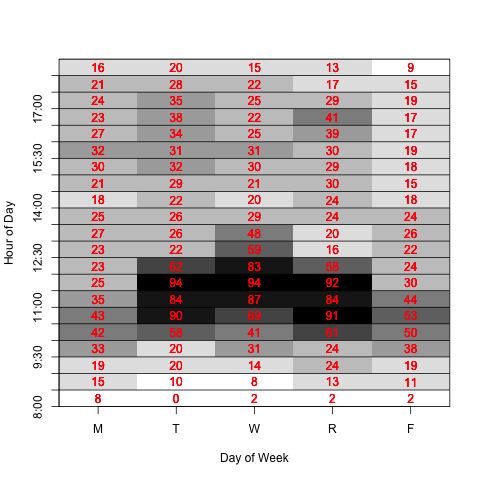

# CalcOfficeHours

This package helps find good times for office hours by 
finding when the students in a course are available and unavailable using their
course schedules.


```r
library(CalcOfficeHours)
sisr = RCurl::getCurlHandle(cookie = cookie("sisr.cookie"), followlocation = TRUE, cookiejar = "")
tm = mkTimes("141B", "STA", term = "202203", con = sisr)
plot(tm)
```


## Existing and Intermediate Objects

We can break this into separate steps when we want the
intermediate objects for other purposes, e.g., the roster,
the student schedules.

We may already have the roster
```r
ros = SISRTools::getRoster("141B", "202203", curl = sisr)
```

We can then pass this to `mkTimes()`
```r
tm = mkTimes(ros = ros, con = sisr)
plot(tm)
```


However, we can also fetch the student schedules separately
so we have them later.
```r
tms = getStudentTimes(ros, sisr, "202203")
```
and then pass the result to `mkTimes()`
```r
tm = mkTimes(studentTimes = tms)
plot(tm)
```

An example of the resulting display is




<!--
# ros = readRDS("roster.rds")
# tms = readRDS("tms.rds")
-->

